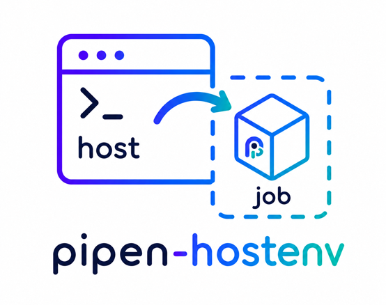

<div align="center">
    

   <p style="font-weight:bold;">Bring your host environment variables into the jobs of
   <a href="https://github.com/pwwang/pipen" target="_blank">pipen</a> pipelines.
   </p>

</div>

<hr />

Bring your host environment variables into the jobs of [pipen](https://github.com/pwwang/pipen) pipelines.

Variables are read when each job is initialized and injected into the job's wrapper script
(`export VAR='value'`), so they are available as `$VAR` in `script` and to any process the job
starts. The pipen process itself is not modified.

Installing the plugin is all it takes — pipen loads it through its `pipen` entry point.

## Installation

```bash
pip install pipen-hostenv
```

## Usage

By default `./.env`, relative to the directory pipen is run from, is loaded for every job:

```python
from pipen import Proc, run

class P1(Proc):
    input = "name:var"
    output = "o:file:{{in.name}}.txt"
    script = "echo ${{in.name}} > {{out.o}}"

run("MyPipeline", starts=P1, data=["VAR"])  # $VAR comes from ./.env
```

### Custom env file

Per process:

```python
class P1(Proc):
    plugin_opts = {"hostenv_file": "./envfile"}
```

Or for the whole pipeline:

```python
run("MyPipeline", starts=P1, data=["VAR"], plugin_opts={"hostenv_file": "./envfile"})
```

### Passing values directly

```python
run(
    "MyPipeline",
    starts=P1,
    data=["VAR"],
    plugin_opts={"hostenv_values": {"VAR": "green grass"}},
)
```

## Options

| Option           | Default    | Description                                                                                                                                                              |
| ---------------- | ---------- | ------------------------------------------------------------------------------------------------------------------------------------------------------------------------ |
| `hostenv_file`   | `./.env`   | Path to a [dotenv](https://github.com/theskumar/python-dotenv) file. Resolved against the working directory of the pipen process and silently skipped when it is missing. Set it to a falsy value to disable file loading. |
| `hostenv_values` | `{}`       | Mapping of environment variables to pass to the jobs directly.                                                                                                            |

## Precedence

For a given job, lowest to highest:

1. `job.envs` of the process
2. Entries read from `hostenv_file`
3. Entries from `hostenv_values`

`plugin_opts` are merged per process on top of the pipeline configuration, so options set on a
`Proc` class win over those passed to `run()`/`Pipen()`. The merge is shallow — a process-level
`hostenv_values` replaces the pipeline-level one entirely rather than merging key by key.

## Notes

- A pipeline-level env file applies to every process; override it for a single process with
  process-level `plugin_opts`.
- Only shell variables (`$VAR`) are populated. The values are not available as template variables
  at script rendering time (`{{ envs.VAR }}` renders empty).
